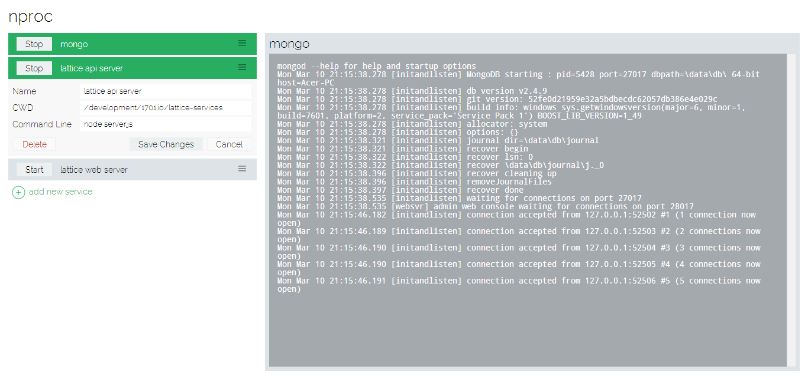

nproc
=====

Node-based Process Manager

nproc provides a node-based microserver to allow browser-based definition and management of a set of processes.

The idea behind nproc is to be able to have a set of processes, such as your database and other services controllable from a single place.  

Screenshot
----------

Installation
------------

    npm install -g nproc

Usage
-----

From any command-line console type:

    nproc

This will start the microserver on port 3000.

Now you can start up your browser at http://localhost:3000.  Note that if you have the name or IP address of the machine that nproc is running on, you can access it remotely (this can be both good and bad, see Uncle Ben below).

### Defining Processes

Click the green "+ add new service" link and fill out the resulting form:

- Name: the human-readable title of this process
- CWD: the working directory that the process will use
- Command Line: the executable and arguments to run

Obviously, "Save Changes" will save your changes and add the process to the list, "Cancel" will cancel your changes.

### Starting / Stopping a Process

Clicking on the "Start" button next to the service title will start the process.  The service list item will turn green while it is running, and the "Stop" button will replace the "Start" button.  Remember the process is running inside the node microserver and will continue running as long as the microserver is running, regardless if you close your browser.

### Viewing a Process

Clicking on the service title name will bring up a view of the output console for the process on the right.  It is updated every two seconds.

### Editing / Deleting a Process

Clicking on the menu lines on the right end of the service title will open up the options for that service.  There will be the three textboxes which will allow you to change their values.  Note that changing anything except the "name" field will have no effect until the process is restarted.

In addition there is a "delete" button for deleting the service from your list.  Note that this will not ask you to confirm and will instantly erase your service.  It will attempt to stop the service first.

### Saving

Whenever you press a "Save Changes" button, whether while adding or modifying settings, it is saved to disk in a "services.json" file in the directory that nproc is run from.

Uncle Ben
---------

I am so very sorry but I have to say this:

> "With Great Power... Comes Great Responsibility"

This allows anyone who can ping your machine to arbitrarily define processes and execute them.  It is YOUR responsibility to make sure that you are taking the precautions that are appropriate for your environment!

